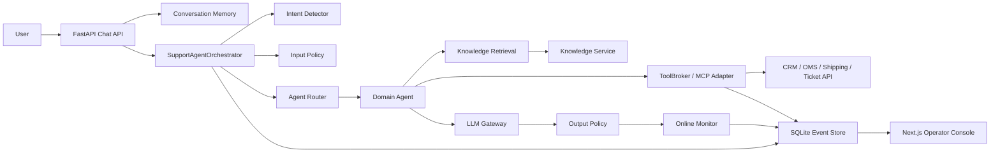

# Production Support Agent Lab

[](https://github.com/kiryce/production-support-agent-lab/actions/workflows/ci.yml)
[](LICENSE)

一个面向 Agent 初学者的小型生产级客服 Agent 项目。

它不是 benchmark 复刻，也不是一个大 prompt 聊天玩具。这个仓库把开放域客服 Agent 拆成可以运行、可以追踪、可以评测、可以监控、可以部署的工程模块：

- 意图识别和槽位抽取
- 多 Agent routing
- MCP 风格工具治理
- 多轮对话记忆和事件回放
- RAG 检索、citation 和召回诊断
- 端到端 eval 和 regression case
- 在线 monitor agent 和告警处置
- 工具失败、权限失败、超时和幂等
- 生产模式下的真实 HTTP adapter、真实 OpenAI provider、签名鉴权、readiness 和 Docker 部署
- 配套 Next.js 运维控制台

目标很朴素：让新手可以按部就班看懂一个 Agent 为什么能上线，而不是只看到一段“看起来很聪明”的 prompt。

## 先看边界

本项目有两种模式。

| 模式 | 用途 | 是否能直接处理真实流量 |
| --- | --- | --- |
| `local` | 学习、跑测试、跑 demo。使用 deterministic model 和本地 fixtures。 | 不能。它只用于教学和本地验证。 |
| `production` | 连接真实 OpenAI、真实业务 HTTP API、真实知识库 HTTP API、持久 event store 和签名网关。缺配置会 fail fast。 | 可以作为单实例或 staging baseline 上线。 |

“不能用 mock”在这里的含义是：生产模式绝不会偷偷退回本地 fixtures。你必须接入自己的 CRM/OMS/物流/工单/知识库服务，否则应用会在启动或 readiness 阶段失败。

默认生产持久层是 SQLite event store，适合单实例部署或 staging。多实例高并发时，请按 `docs/production-hardening.md` 的路线替换为 Postgres/Kafka/warehouse。

## 前端控制台

仓库已经内置一个可运行的 Next.js 运维控制台，目录是 `frontend/`。

它不是静态 mock dashboard。前端通过 server-side BFF 调真实 FastAPI Agent API，覆盖：

- monitor alert queue、状态筛选、搜索、排序
- triage health、MTTA、MTTR、stale alert、new-after-triage
- alert delivery：读取 durable outbox，显示 webhook 是否禁用、排队、backoff、claimed、失败、dead-letter，并可由值班人员 replay/close
- monitor drilldown 和 failure/intent/risk buckets
- persisted run search
- tool audit 和工具 SLA 统计
- RAG recall diagnostics，返回安全 snippet 而不是完整文档
- incident brief，一键复制 Markdown
- memory replay
- staging eval gate 和 append-only eval gate history
- promotion gate：聚合 readiness、monitor、tool audit、staging eval，判断是否可晋级
- 从真实 monitor event 生成 regression eval draft

本地运行后打开：

```text
http://127.0.0.1:3000
```

详细说明见 `docs/frontend-console.md`。视觉和交互设计说明见 `docs/product-design-brief.md`。

## 快速开始

### 前置条件

- Python 3.11 或更高版本，推荐 Python 3.12。
- Node.js 20 或更高版本。
- pnpm，用于运行 `frontend/` 控制台。
- Git。
- 可选：Docker Desktop，用于容器化运行和镜像构建验证。

### 0. 克隆并进入项目

```bash
git clone https://github.com/kiryce/production-support-agent-lab.git
cd production-support-agent-lab
```

如果你是在 Codex 生成的 outputs 目录中继续工作，进入：

```powershell
cd outputs\production-support-agent-lab
```

### 1. 本地安装

Windows PowerShell:

```powershell
python -m venv .venv
.\.venv\Scripts\Activate.ps1
python -m pip install --upgrade pip
python -m pip install -e ".[dev]"
```

macOS/Linux:

```bash
python -m venv .venv
. .venv/bin/activate
pip install --upgrade pip
pip install -e ".[dev]"
```

如果 PowerShell 执行策略阻止 `Activate.ps1`，可以不激活虚拟环境，直接把后续 `python` 命令写成 `.\.venv\Scripts\python`。

### 2. 跑总门禁

```bash
python scripts/run_release_check.py
```

这条命令会跑：

- `pip check`
- 生产请求签名 smoke
- 全量单测
- golden eval
- security regression eval
- tool failure regression eval
- memory multiturn regression eval
- routing regression eval
- monitor regression eval
- retrieval challenge eval

它不调用 OpenAI，也不调用你的真实业务系统。它是本地确定性门禁。

### 3. 启动后端

```bash
python -m uvicorn support_agent_lab.api.main:app --reload
```

打开 API 文档：

```text
http://127.0.0.1:8000/docs
```

健康检查：

```text
http://127.0.0.1:8000/api/v1/health
http://127.0.0.1:8000/api/v1/ready
http://127.0.0.1:8000/metrics
```

`/health` 只表示进程活着。`/ready` 会检查配置和 event store；生产深探测开启时还会检查 OpenAI、业务 API `/health` 和知识库 API `/health`。
`/metrics` 是 Prometheus text format，用于机器抓取聚合指标：HTTP 请求计数、限流决策、monitor event、monitor triage health、alert delivery outbox、tool audit、adapter circuit、LLM fallback 和 rate-limit 配置。它不输出用户、trace、alert key、triage note、工具参数或知识库正文。

### 4. 启动前端控制台

另开一个终端：

```bash
cd frontend
pnpm install
pnpm dev
```

打开：

```text
http://127.0.0.1:3000
```

点击 `Run Scenario` 会通过真实本地 API 创建 session、发送 message、写入 event store、生成 monitor event，再把 trace 拉回控制台。

## 第一条 HTTP 闭环

先创建会话：

```bash
curl -X POST http://127.0.0.1:8000/api/v1/chat/sessions \
  -H "Content-Type: application/json" \
  -H "X-Demo-User: user_demo" \
  -d '{"user_id":"user_demo"}'
```

返回类似：

```json
{
  "conversation_id": "conv_abc123",
  "user_id": "user_demo"
}
```

再发送消息：

```bash
curl -X POST http://127.0.0.1:8000/api/v1/chat/messages \
  -H "Content-Type: application/json" \
  -H "X-Demo-User: user_demo" \
  -d '{"conversation_id":"conv_abc123","user_id":"user_demo","content":"我订单 A1001 的耳机坏了，能退吗？"}'
```

重点看返回里的：

```json
{
  "trace_id": "run_abc123",
  "handoff_required": false,
  "citations": [
    {
      "document_id": "return_policy_v3"
    }
  ]
}
```

然后查看 trace：

```bash
curl http://127.0.0.1:8000/api/v1/agent/runs/run_abc123
```

如果能看到 `intent`、`route`、`retrieval`、`tool_results`、`llm_calls`、`policy_findings` 和 `spans`，说明本地 Agent 闭环已经跑通。

## 新手学习路线

不要从 prompt 开始猜。先看 trace，判断是哪一层坏了，再把真实失败沉淀成 eval。

| 步骤 | 看什么 | 入口文件 | 配套文档 | 回归样本 |
| --- | --- | --- | --- | --- |
| 意图识别 | `trace.intent`、`missing_slots`、`entities` | `src/support_agent_lab/agent/intent.py` | `docs/intent-playbook.md` | `examples/evals/routing_regression.json` |
| 多 Agent routing | `trace.route.target`、`allowed_tools` | `src/support_agent_lab/agent/router.py` | `docs/routing-playbook.md` | `examples/evals/routing_regression.json` |
| 工具治理/MCP | `trace.tool_results`、tool audit | `src/support_agent_lab/tools/registry.py`、`src/support_agent_lab/mcp/adapter.py` | `docs/mcp-tools.md`、`docs/tool-failure-playbook.md` | `examples/evals/tool_failure_regression.json` |
| 多轮记忆 | `state.facts`、memory replay | `src/support_agent_lab/memory/store.py`、`src/support_agent_lab/memory/replay.py` | `docs/memory-playbook.md` | `examples/evals/memory_multiturn_regression.json` |
| RAG/citation | `trace.retrieval`、`response.citations` | `src/support_agent_lab/memory/store.py` | `docs/retrieval-playbook.md` | `examples/evals/retrieval_challenge.json` |
| 端到端 eval | `observed_*`、`failures` | `src/support_agent_lab/evals/runner.py` | `docs/evaluation-monitoring.md` | `examples/evals/*.json` |
| Online monitor | alerts、risk、failure type | `src/support_agent_lab/monitoring/monitor.py` | `docs/evaluation-monitoring.md` | `examples/evals/monitor_regression.json` |
| 生产部署 | signed actor、readiness、real adapters | `src/support_agent_lab/config.py`、`src/support_agent_lab/bootstrap.py` | `docs/production-deployment.md` | `scripts/run_release_check.py --production-config` |

### 建议练习

1. 跑 `python scripts/run_release_check.py`，确认基线全绿。
2. 用本地 API 发一条退款问题，打开 `/api/v1/agent/runs/{trace_id}`。
3. 找出 intent、route、retrieval、tool、policy、monitor 分别在 trace 哪个字段。
4. 故意加一个失败 eval case，观察 runner 输出的 `failures`。
5. 打开 `docs/tool-failure-playbook.md`，理解工具超时、越权、NOT_FOUND 为什么不能靠 prompt 兜底。
6. 运行 `python scripts/run_retrieval_eval.py`，看 retrieval challenge 如何定位召回问题。
7. 在控制台里从 monitor alert 打开 incident brief，再生成 regression draft。
8. 修复后跑相关 eval 和全量 release check。

## 核心架构



关键设计：

- `SupportAgentOrchestrator` 负责串起一次完整 run。
- `IntentDetector` 不追求神秘大模型分类，先用可解释规则和 regression case 建立基线。
- `AgentRouter` 根据 intent、风险、情绪和策略选择领域 Agent。
- `ToolBroker` 强制执行 schema、scope、timeout、idempotency、audit 和 error normalization。
- `KnowledgeIndex` / `HTTPKnowledgeIndex` 统一本地和生产 RAG 边界。
- `LLMGateway` 统一模型 provider，本地 deterministic，生产 OpenAI Responses API。
- `PolicyEngine` 在输入、输出、记忆和事件写入前处理 PII、prompt injection 和高风险行为。
- `OnlineMonitorAgent` 从真实 trace 生成线上质量事件。
- `SQLiteEventStore` 记录 append-only message、run、monitor、triage、eval gate，以及工具幂等和工具审计。

## 生产模式

复制配置：

```bash
cp .env.example .env
```

关键环境变量：

```text
APP_ENV=production
APP_TENANT_ID=your_real_tenant
APP_REQUIRE_PRODUCTION=true
APP_MODEL_PROVIDER=openai
APP_OPENAI_MODEL=gpt-5.5
OPENAI_API_KEY=...
APP_BUSINESS_API_BASE_URL=https://support-backend.example.com
APP_BUSINESS_API_KEY=...
APP_BUSINESS_API_RETRY_ATTEMPTS=2
APP_BUSINESS_API_RETRY_BACKOFF_MS=100
APP_BUSINESS_API_CIRCUIT_FAILURE_THRESHOLD=5
APP_BUSINESS_API_CIRCUIT_RESET_SECONDS=30
APP_KNOWLEDGE_API_BASE_URL=https://knowledge.example.com
APP_KNOWLEDGE_API_KEY=...
APP_KNOWLEDGE_API_RETRY_ATTEMPTS=2
APP_KNOWLEDGE_API_RETRY_BACKOFF_MS=100
APP_KNOWLEDGE_API_CIRCUIT_FAILURE_THRESHOLD=5
APP_KNOWLEDGE_API_CIRCUIT_RESET_SECONDS=30
APP_LLM_TIMEOUT_MS=15000
APP_LLM_RETRY_ATTEMPTS=2
APP_LLM_RETRY_BACKOFF_MS=250
APP_LLM_CIRCUIT_FAILURE_THRESHOLD=5
APP_LLM_CIRCUIT_RESET_SECONDS=30
APP_INTERNAL_API_KEY=...
APP_ACTOR_SIGNATURE_SECRET=replace_with_real_actor_signature_secret_min_32_chars
APP_REQUEST_SIGNATURE_REQUIRED=true
APP_RATE_LIMIT_ENABLED=true
APP_RATE_LIMIT_REQUESTS_PER_MINUTE=600
APP_RATE_LIMIT_BURST=600
APP_DATABASE_URL=sqlite:///./data/production/support-agent-lab.db
```

可选的主动告警 webhook：

```text
APP_MONITOR_ALERT_WEBHOOK_ENABLED=true
APP_MONITOR_ALERT_WEBHOOK_URL=https://hooks.example.com/agent-alerts
APP_MONITOR_ALERT_WEBHOOK_SECRET=replace_with_real_webhook_secret_min_32_chars
APP_MONITOR_ALERT_MIN_SEVERITY=P1
APP_MONITOR_ALERT_MAX_ATTEMPTS=3
APP_MONITOR_ALERT_BACKOFF_BASE_SECONDS=60
APP_MONITOR_ALERT_BACKOFF_MAX_SECONDS=900
APP_MONITOR_ALERT_CLAIM_LEASE_SECONDS=120
```

生产模式需要真实业务 API：

```text
GET  /customers/{user_id}
GET  /orders?customer_id=<id>&status=<optional>
GET  /orders/{order_id}
GET  /shipments/{logistics_id}
POST /tickets
GET  /knowledge/search?query=<text>&limit=<n>
GET  /health
```

完整 contract 见 `docs/production-deployment.md`。

### 生产鉴权

生产请求必须由可信网关注入并签名：

```text
X-Internal-Auth: <APP_INTERNAL_API_KEY>
X-Actor-User-Id: <authenticated user>
X-Actor-Roles: user 或 admin
X-Actor-Scopes: crm:read,order:read,shipping:read,ticket:write,kb:read
X-Actor-Timestamp: <unix timestamp>
X-Actor-Signature: sha256=<HMAC over tenant/user/roles/scopes/timestamp>
X-Request-Nonce: <unique request nonce>
X-Request-Body-SHA256: <sha256 of exact request body bytes>
X-Request-Signature: sha256=<HMAC over tenant/user/roles/scopes/timestamp/nonce/method/path/body hash>
```

`X-Demo-User` 和 `X-Demo-Role` 只在 local mode 生效。生产模式会拒绝 `user_demo`、`user_guest` 等本地身份。

生成 smoke-test header：

```bash
python scripts/sign_actor_headers.py \
  --user-id user_prod \
  --roles user \
  --scopes "crm:read,order:read,shipping:read,ticket:write,kb:read" \
  --method POST \
  --path /api/v1/chat/sessions \
  --body '{"user_id":"user_prod"}' \
  --format curl
```

Admin 不是全能权限。生产 admin endpoint 还需要显式 scope，例如：

```text
monitor:read
monitor:write
events:read
audit:read
eval:read
eval:run
knowledge:diagnose
memory:replay
admin:read
```

## Docker

```bash
cp .env.example .env
docker compose up --build
```

默认服务：

```text
Backend:  http://127.0.0.1:8000
Console:  http://127.0.0.1:3000
```

Docker `HEALTHCHECK` 使用 `/api/v1/ready`，不是只检查 `/health`。

## Eval 和监控

常用命令：

```bash
python scripts/run_eval.py
python scripts/run_eval.py examples/evals/security_regression.json
python scripts/run_eval.py examples/evals/tool_failure_regression.json
python scripts/run_eval.py examples/evals/memory_multiturn_regression.json
python scripts/run_eval.py examples/evals/routing_regression.json
python scripts/run_monitor_eval.py
python scripts/run_retrieval_eval.py
```

Eval 不只看最终回答，还检查：

- observed intent
- observed route
- missing slots
- allowed tools
- called tools
- memory facts
- required tool outputs
- error codes
- policy codes
- citation 命中
- answer 中必须包含或禁止包含的内容

控制台里的 staging eval gate 会调用 `/api/v1/admin/evals/staging`，依次跑 `golden_core`、security、tool failure、memory、routing、monitor、retrieval suites，并追加每个 suite 的 `eval.gate.completed` 事件，最后再追加一条 aggregate gate record。记录里有 actor、trigger、suite、run/alert context、duration、status、failed case ids 和 case observation，但不会保存完整 answer。

生产环境会拒绝 `/api/v1/admin/evals/golden` 和 `/api/v1/admin/evals/staging`，避免 lab fixtures 打到真实系统。请在 CI 或 staging sandbox 跑 eval。

`/api/v1/admin/promotion/gate` 是只读发布前检查：它不会自动跑 eval 或改 triage，而是读取 readiness、monitor triage metrics、tool audit summary 和最新 staging aggregate eval gate，返回 `passed`、`warn` 或 `blocked` 以及每条 evidence。控制台会把这个状态放进 Overview 和 Production Preflight。

`/metrics` 会把同一套 monitor triage 投影导出成低基数机器指标，例如 `support_agent_monitor_triage_active_alerts`、`support_agent_monitor_triage_new_events_since_triage`、`support_agent_monitor_triage_health_status{status="critical"}`、`support_agent_monitor_triage_active_alerts_by_severity{severity="P0"}` 和 `support_agent_monitor_triage_mtta_seconds`。这些适合 Prometheus alert rule；控制台仍然负责展示具体 alert、run、事件和处置备注。

`/api/v1/admin/monitor/alert-deliveries/dispatch` 会从持久化 monitor events 派生 P0/P1 active alerts，写入 `alert_delivery_outbox`，再 claim 到期可发送的 delivery。失败会按指数 backoff 设置 `next_attempt_at`；超过 `APP_MONITOR_ALERT_MAX_ATTEMPTS` 后进入 dead-letter，不再自动重试。控制台 Delivery ledger 可以对 `dead` row 做 replay/requeue 或 close，动作会写入 append-only audit event。它不会把用户原文、工具参数或 eval answer 放进通知 payload，只发送 alert key、severity、reason、sample run/event ids 和时间窗口。`GET /api/v1/admin/monitor/alert-deliveries/summary` 给控制台展示 webhook 是 disabled、queued、failed 还是 ok，并返回 in-progress/dead-letter/closed 计数；`/metrics` 会把同一个 durable outbox 聚合成低基数指标，例如 `support_agent_alert_delivery_records{status="dead"}`、`support_agent_alert_delivery_records_by_severity{severity="P0"}` 和 `support_agent_alert_delivery_health_status{status="failed"}`。

## 常用排障入口

| 问题 | 先看哪里 | 下一步 |
| --- | --- | --- |
| 意图识别错 | `trace.intent` | 加 routing regression case，再调整 `intent.py` |
| 路由错 | `trace.route` | 看 `allowed_tools` 和 `needs_human` |
| 工具失败 | `trace.tool_results`、`/api/v1/admin/tools/audit` | 看 error_code、scope、timeout、idempotency key |
| 检索不全 | `trace.retrieval`、Knowledge workbench | 看 rewritten queries、candidates_by_stage、dropped_candidates |
| 没 citation | `response.citations` | 加 retrieval challenge 或调整 answerability |
| 多轮记忆错 | `/api/v1/admin/conversations/{id}/memory/replay` | 看 event replay 是否重建出同样 facts |
| 线上漂移 | `/api/v1/admin/monitor/summary?source=event_store` | 按 intent、risk、failure_type 聚合，再沉淀 regression |
| P0/P1 没人响应 | `/api/v1/admin/monitor/alert-deliveries/summary` | 检查 webhook 配置、backoff、in-progress lease、failed/dead delivery；在控制台 Delivery ledger replay 或 close dead-letter |
| 重复建单 | SQLite `tool_idempotency` 和 tool audit | 确认写工具必须带 idempotency key |
| 越权/隐私风险 | `policy_findings`、monitor event、tool audit actor | 检查 scope、tenant、业务服务授权和脱敏 |

## 项目结构

```text
src/support_agent_lab/
  agent/          # intent、router、domain agents、policy、orchestrator
  api/            # FastAPI app、auth、request signatures、readiness
  data/           # local learning fixtures
  evals/          # end-to-end, monitor, retrieval eval runners
  llm/            # LLM gateway, OpenAI provider, deterministic provider
  mcp/            # MCP adapter and local-only server
  memory/         # conversation memory, event replay, knowledge retrieval
  monitoring/     # online monitor agent
  scripts/        # release check, demo, signer
  security/       # HMAC actor/request signature helpers
  tools/          # ToolBroker, business tools, HTTP tools, audit

examples/evals/   # golden and regression suites
frontend/         # Next.js operator console
docs/             # architecture, playbooks, deployment, hardening
tests/            # unit, API, auth, eval, retrieval, MCP, event-store tests
```

## MCP 和工具治理

工具不是把数据库或内部 API 直接暴露给模型，而是受治理的业务能力边界：

```text
crm.get_customer
order.search
order.get
shipping.track
ticket.create
kb.search
```

本地可以安装可选 MCP SDK：

```bash
pip install -e ".[mcp]"
python -m support_agent_lab.mcp.server
```

内置 MCP server 只用于 local mode 教学。生产模式需要自己的 MCP gateway 注入 authenticated actor、tenant、scopes、request id、trace id 和写工具 idempotency key。完整说明见 `docs/mcp-tools.md`。

## 生产加固路线

当前 baseline 已经能作为单实例或 staging 应用运行。继续扩到高流量多租户平台时，建议补：

- Postgres/Kafka event store
- Redis/Postgres request nonce store
- OpenTelemetry exporter
- 异步 monitor worker
- SIEM/warehouse audit export
- 多模型 fallback 和成本预算
- 更强 PII detector 和合规审批流
- 检索服务的 hard negative、metadata filter、reranker、answerability gate

详细路线见 `docs/production-hardening.md`。

## 常见问题

| 现象 | 原因 | 处理 |
| --- | --- | --- |
| `No module named pytest` | 没装 dev 依赖 | 运行 `pip install -e ".[dev]"` |
| `No module named support_agent_lab` | 没在仓库根目录安装 editable package | 回到仓库根目录重新安装 |
| `Address already in use` | 8000 或 3000 端口被占用 | 换端口或停止旧进程 |
| PowerShell `curl` JSON 失败 | `curl` 是 `Invoke-WebRequest` 别名 | 用 `curl.exe` 或 FastAPI `/docs` |
| eval citation 失败 | 检索没召回正确文档 | 看 `trace.retrieval`、tokenizer、query rewrite、rerank |
| 生产启动失败 | 必需配置缺失或是 placeholder | 按 `docs/production-deployment.md` 补真实配置 |
| 生产请求 401 | 签名、timestamp、nonce、body hash 或 gateway key 不匹配 | 用 `scripts/sign_actor_headers.py` 重新生成精确请求签名 |
| admin 请求 403 | 少了管理 scope | 查看 production scope 表，补最小 scope |

## 参考文档

- `docs/architecture.md`
- `docs/trace-walkthrough.md`
- `docs/annotated-trace.md`
- `docs/intent-playbook.md`
- `docs/routing-playbook.md`
- `docs/mcp-tools.md`
- `docs/tool-failure-playbook.md`
- `docs/memory-playbook.md`
- `docs/retrieval-playbook.md`
- `docs/evaluation-monitoring.md`
- `docs/frontend-console.md`
- `docs/production-deployment.md`
- `docs/production-hardening.md`

## License

MIT
