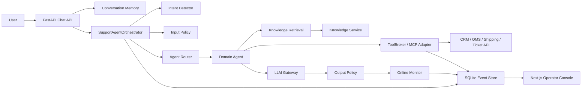

# Production Support Agent Lab

[](https://github.com/kiryce/production-support-agent-lab/actions/workflows/ci.yml)
[](LICENSE)

一个面向 Agent 初学者的小型生产级客服 Agent 项目。

它不是 benchmark 复刻，也不是一个大 prompt 聊天玩具。这个仓库把开放域客服 Agent 拆成可以运行、可以追踪、可以评测、可以监控、可以部署的工程模块：

- 意图识别和槽位抽取
- 多 Agent routing
- MCP 风格工具治理
- 多轮对话记忆和事件回放
- RAG 检索、citation 和召回诊断
- 端到端 eval 和 regression case
- 在线 monitor agent 和告警处置
- 线上 response feedback：用户/坐席 thumbs up/down、reason、comment 进入 append-only event store，再给 admin 汇总、复核队列和 regression draft 沉淀
- 工具失败、权限失败、超时和幂等
- 生产模式下的真实 HTTP adapter、真实 OpenAI provider、签名鉴权、readiness 和 Docker 部署
- 配套 Next.js 运维控制台

目标很朴素：让新手可以按部就班看懂一个 Agent 为什么能上线，而不是只看到一段“看起来很聪明”的 prompt。

## 先看边界

本项目有两种模式。

| 模式 | 用途 | 是否能直接处理真实流量 |
| --- | --- | --- |
| `local` | 学习、跑测试、跑 demo。使用 deterministic model 和本地 fixtures。 | 不能。它只用于教学和本地验证。 |
| `production` | 连接真实 OpenAI、真实业务 HTTP API、真实知识库 HTTP API、持久 event store 和签名网关。缺配置会 fail fast。 | 可以作为单实例或 staging baseline 上线。 |

“不能用 mock”在这里的含义是：生产模式绝不会偷偷退回本地 fixtures。你必须接入自己的 CRM/OMS/物流/工单/知识库服务，否则应用会在启动或 readiness 阶段失败。

默认生产持久层是 SQLite event store，适合单实例部署或 staging；连接层会启用 WAL、5 秒 busy timeout、`synchronous=NORMAL` 和外键约束。多实例高并发时，请按 `docs/production-hardening.md` 的路线替换为 Postgres/Kafka/warehouse。

## 前端控制台

仓库已经内置一个可运行的 Next.js 运维控制台，目录是 `frontend/`。

它不是静态 mock dashboard。前端通过 server-side BFF 调真实 FastAPI Agent API，覆盖：

- monitor alert queue、状态筛选、搜索、排序
- triage health、MTTA、MTTR、stale alert、new-after-triage
- alert delivery：读取 durable outbox 和 dispatcher heartbeat，显示 webhook 是否禁用、排队、backoff、claimed、失败、dead-letter、worker 是否 stale/missing，并可由值班人员 replay/close
- monitor review worker：后台补齐已完成 run 的 `monitor.reviewed` 事件，控制台显示 heartbeat active/stale/missing 和最新 cycle 计数
- live snapshot freshness：自动刷新真实 `/api/console/snapshot`，显示 fresh/stale 状态，标记新增或更新的 alert 卡片，并在快照过期时阻止 alert / delivery 写操作
- monitor drilldown 和 failure/intent/risk buckets
- persisted run search
- tool audit 和工具 SLA 统计
- RAG recall diagnostics，返回安全 snippet 而不是完整文档
- incident brief：后端生成脱敏 Markdown，控制台可复制或下载
- incident timeline：按时间排序展示脱敏后的 event、tool audit、feedback、triage、delivery 和 eval gate 证据
- memory replay
- response feedback workbench：读取真实 run 的好评/差评、reason 分布、用户评论和复核积压指标，记录 append-only review trail，并从负反馈生成 regression draft
- staging eval gate 和 append-only eval gate history
- promotion gate：聚合 readiness、monitor、tool audit、response feedback、staging eval，判断是否可晋级
- SLO report：按 grounded rate、policy compliance、human review、P0/P1、tool failure、feedback、eval freshness、MTTA、alert delivery、monitor review worker 和 automation execution failure rate 计算服务目标与错误预算
- release decision audit：把 approve/reject/defer、actor、备注和当时的 gate snapshot 写入 append-only event store
- operations automation plan：聚合 monitor、alert delivery、promotion gate、tool audit、feedback、eval 证据，返回可执行 endpoint、scope、guardrail 和是否可自动执行，适合接 cron、值班机器人或发布前检查；控制台执行 auto-safe 动作后会写入 automation execution ledger，并能在 Settings 里按 action kind、status、source 和 actor 查询执行历史
- audit export：把脱敏后的 event/tool audit/event-store operation/automation execution 摘要导出为 NDJSON；也可以跑常驻 batch worker 落盘 NDJSON + manifest，方便接 SIEM 或 warehouse
- event-store operation ledger + operation lock：备份、恢复演练、保留策略预览/应用会先获取 SQLite 租约锁，拒绝并发维护操作；完成、拒绝、失败都会写入独立台账；台账不参与 retention high-water mark，所以不会让自己的 guard token 过期
- 从真实 monitor event 或 response feedback 生成 regression eval draft

本地运行后打开：

```text
http://127.0.0.1:3000
```

Production console mode protects `/` and `/api/console/*` with server-side Basic Auth before the BFF can sign backend requests; configure `FRONTEND_CONSOLE_USERNAME` and `FRONTEND_CONSOLE_PASSWORD`. Production write requests to `/api/console/*` also require same-origin browser evidence through `Origin` or `Sec-Fetch-Site`, so cross-site POSTs are rejected even if a browser has cached console credentials. The BFF actor is also fail-closed in production: `AGENT_API_BASE_URL`, `APP_TENANT_ID`, `APP_INTERNAL_API_KEY`, `APP_ACTOR_SIGNATURE_SECRET`, `FRONTEND_ACTOR_USER_ID`, `FRONTEND_ACTOR_ROLES`, and `FRONTEND_ACTOR_SCOPES` must be explicit real values, not placeholders or local demo defaults; the backend gateway secrets must be at least 32 characters.

详细说明见 `docs/frontend-console.md`。视觉和交互设计说明见 `docs/product-design-brief.md`。

## 快速开始

### 前置条件

- Python 3.11 或更高版本，推荐 Python 3.12。
- Node.js 20 或更高版本。
- pnpm，用于运行 `frontend/` 控制台。
- Git。
- 可选：Docker Desktop，用于容器化运行和镜像构建验证。

### 0. 克隆并进入项目

```bash
git clone https://github.com/kiryce/production-support-agent-lab.git
cd production-support-agent-lab
```

如果你是在 Codex 生成的 outputs 目录中继续工作，进入：

```powershell
cd outputs\production-support-agent-lab
```

### 1. 本地安装

Windows PowerShell:

```powershell
python -m venv .venv
.\.venv\Scripts\Activate.ps1
python -m pip install --upgrade pip
python -m pip install -e ".[dev]"
```

macOS/Linux:

```bash
python -m venv .venv
. .venv/bin/activate
pip install --upgrade pip
pip install -e ".[dev]"
```

如果 PowerShell 执行策略阻止 `Activate.ps1`，可以不激活虚拟环境，直接把后续 `python` 命令写成 `.\.venv\Scripts\python`。

### 2. 跑总门禁

```bash
python scripts/run_release_check.py
```

这条命令会跑：

- deployment policy check（Compose 端口、前端高权限环境变量、console 同源写保护、前端 lint 依赖）
- `pip check`
- 生产请求签名 smoke
- 全量单测
- golden eval
- security regression eval
- tool failure regression eval
- memory multiturn regression eval
- routing regression eval
- monitor regression eval
- retrieval challenge eval

它不调用 OpenAI，也不调用你的真实业务系统。它是本地确定性门禁。

### 3. 启动后端

```bash
python -m uvicorn support_agent_lab.api.main:app --reload
```

打开 API 文档：

```text
http://127.0.0.1:8000/docs
```

健康检查：

```text
http://127.0.0.1:8000/api/v1/health
http://127.0.0.1:8000/api/v1/ready
http://127.0.0.1:8000/metrics
```

`/health` 只表示进程活着。`/ready` 会检查配置、event store，以及生产模式下的备份目录和审计导出目录写探针；生产深探测开启时还会检查 OpenAI、业务 API `/health` 和知识库 API `/health`。
Use `/api/v1/ready?deep=true&ops=true` as a stricter production preflight after
the API and worker profiles are expected to be running. It adds checks for alert
dispatcher heartbeat, monitor review worker heartbeat, and fresh non-partial
audit export batches; plain `/ready` keeps those ops checks disabled by default.
`/metrics` 是 Prometheus text format，用于机器抓取聚合指标：HTTP 请求计数、限流决策、monitor event、monitor triage health、monitor review worker heartbeat、alert delivery outbox、alert dispatcher heartbeat、audit export batch health、feedback review backlog、automation execution health、tool audit、adapter circuit、LLM fallback、有效 rate-limit backend 和 rate-limit 配置。它不输出用户、trace、alert key、triage note、feedback comment、review note、自动化 action id、工具参数、worker id、完整文件路径或知识库正文。

### 4. 启动前端控制台

另开一个终端：

```bash
cd frontend
pnpm install
pnpm dev
```

打开：

```text
http://127.0.0.1:3000
```

点击 `Run Scenario` 会通过真实本地 API 创建 session、发送 message、写入 event store、生成 monitor event，再把 trace 拉回控制台。
控制台会定时刷新 `/api/console/snapshot`；如果页面隐藏会暂停，重新回到页面会立即补一次刷新。顶部的 freshness 状态变成 stale 后，控制台仍允许搜索、筛选、导出，但会阻止 acknowledge、assign、resolve、dispatch、replay、close 等依赖当前监控状态的写操作，直到你手动 `Refresh` 或 live refresh 拉到新快照。
同时，alert triage 写入会把当前 alert 的 expected state 发给后端；如果另一个值班员已经处理过，或新的 monitor event 已经到达，后端会返回 `409 Conflict`，不会把旧页面上的操作写进 append-only triage log。

## 第一条 HTTP 闭环

先创建会话：

```bash
curl -X POST http://127.0.0.1:8000/api/v1/chat/sessions \
  -H "Content-Type: application/json" \
  -H "X-Demo-User: user_demo" \
  -d '{"user_id":"user_demo"}'
```

返回类似：

```json
{
  "conversation_id": "conv_abc123",
  "user_id": "user_demo"
}
```

再发送消息：

```bash
curl -X POST http://127.0.0.1:8000/api/v1/chat/messages \
  -H "Content-Type: application/json" \
  -H "X-Demo-User: user_demo" \
  -d '{"conversation_id":"conv_abc123","user_id":"user_demo","content":"我订单 A1001 的耳机坏了，能退吗？"}'
```

重点看返回里的：

```json
{
  "trace_id": "run_abc123",
  "handoff_required": false,
  "citations": [
    {
      "document_id": "return_policy_v3"
    }
  ]
}
```

然后查看 trace：

```bash
curl http://127.0.0.1:8000/api/v1/agent/runs/run_abc123
```

如果能看到 `intent`、`route`、`retrieval`、`tool_results`、`llm_calls`、`policy_findings` 和 `spans`，说明本地 Agent 闭环已经跑通。

## 新手学习路线

不要从 prompt 开始猜。先看 trace，判断是哪一层坏了，再把真实失败沉淀成 eval。

| 步骤 | 看什么 | 入口文件 | 配套文档 | 回归样本 |
| --- | --- | --- | --- | --- |
| 意图识别 | `trace.intent`、`missing_slots`、`entities` | `src/support_agent_lab/agent/intent.py` | `docs/intent-playbook.md` | `examples/evals/routing_regression.json` |
| 多 Agent routing | `trace.route.target`、`allowed_tools` | `src/support_agent_lab/agent/router.py` | `docs/routing-playbook.md` | `examples/evals/routing_regression.json` |
| 工具治理/MCP | `trace.tool_results`、tool audit | `src/support_agent_lab/tools/registry.py`、`src/support_agent_lab/mcp/adapter.py` | `docs/mcp-tools.md`、`docs/tool-failure-playbook.md` | `examples/evals/tool_failure_regression.json` |
| 多轮记忆 | `state.facts`、memory replay | `src/support_agent_lab/memory/store.py`、`src/support_agent_lab/memory/replay.py` | `docs/memory-playbook.md` | `examples/evals/memory_multiturn_regression.json` |
| RAG/citation | `trace.retrieval`、`response.citations` | `src/support_agent_lab/memory/store.py` | `docs/retrieval-playbook.md` | `examples/evals/retrieval_challenge.json` |
| 端到端 eval | `observed_*`、`failures` | `src/support_agent_lab/evals/runner.py` | `docs/evaluation-monitoring.md` | `examples/evals/*.json` |
| Online monitor | alerts、risk、failure type | `src/support_agent_lab/monitoring/monitor.py` | `docs/evaluation-monitoring.md` | `examples/evals/monitor_regression.json` |
| 生产部署 | signed actor、readiness、real adapters | `src/support_agent_lab/config.py`、`src/support_agent_lab/bootstrap.py` | `docs/production-deployment.md` | `scripts/run_release_check.py --production-config` |

### 建议练习

1. 跑 `python scripts/run_release_check.py`，确认基线全绿。
2. 用本地 API 发一条退款问题，打开 `/api/v1/agent/runs/{trace_id}`。
3. 找出 intent、route、retrieval、tool、policy、monitor 分别在 trace 哪个字段。
4. 故意加一个失败 eval case，观察 runner 输出的 `failures`。
5. 打开 `docs/tool-failure-playbook.md`，理解工具超时、越权、NOT_FOUND 为什么不能靠 prompt 兜底。
6. 运行 `python scripts/run_retrieval_eval.py`，看 retrieval challenge 如何定位召回问题。
7. 在控制台里从 monitor alert 打开 incident brief，或从 Feedback workbench 选一条负反馈，记录 review trail，再生成 regression draft。
8. 修复后跑相关 eval 和全量 release check。

发布到真实 staging 前，再跑一次真实预检：

```bash
python scripts/run_release_check.py \
  --production-config \
  --prod-smoke \
  --prod-smoke-ops \
  --base-url https://your-staging-agent.example.com
```

`--prod-smoke-ops` 会要求 deployed API 的 `/api/v1/ready?deep=true&ops=true`
通过，确认 alert dispatcher、monitor review worker 和 audit export batch
这些异步生产环也在运行，而不只是 HTTP API 能启动。

## 核心架构



关键设计：

- `SupportAgentOrchestrator` 负责串起一次完整 run。
- `IntentDetector` 不追求神秘大模型分类，先用可解释规则和 regression case 建立基线。
- `AgentRouter` 根据 intent、风险、情绪和策略选择领域 Agent。
- `ToolBroker` 强制执行 schema、scope、timeout、idempotency、audit 和 error normalization。
- `KnowledgeIndex` / `HTTPKnowledgeIndex` 统一本地和生产 RAG 边界。
- `LLMGateway` 统一模型 provider，本地 deterministic，生产 OpenAI Responses API。
- `PolicyEngine` 在输入、输出、记忆和事件写入前处理 PII、prompt injection 和高风险行为。
- `OnlineMonitorAgent` 从真实 trace 生成线上质量事件。
- `SQLiteEventStore` 记录 append-only message、run、monitor、triage、eval gate，以及工具幂等和工具审计。

## 生产模式

复制配置：

```bash
cp .env.example .env
```

关键环境变量：

```text
APP_ENV=production
APP_TENANT_ID=your_real_tenant
APP_REQUIRE_PRODUCTION=true
APP_MODEL_PROVIDER=openai
APP_OPENAI_MODEL=gpt-5.5
OPENAI_API_KEY=...
APP_BUSINESS_API_BASE_URL=https://support-backend.example.com
APP_BUSINESS_API_KEY=...
APP_BUSINESS_API_RETRY_ATTEMPTS=2
APP_BUSINESS_API_RETRY_BACKOFF_MS=100
APP_BUSINESS_API_CIRCUIT_FAILURE_THRESHOLD=5
APP_BUSINESS_API_CIRCUIT_RESET_SECONDS=30
APP_KNOWLEDGE_BACKEND=auto
APP_KNOWLEDGE_API_BASE_URL=https://knowledge.example.com
APP_KNOWLEDGE_API_KEY=...
APP_KNOWLEDGE_DATABASE_URL=sqlite:///./data/knowledge/support-agent-knowledge.db
APP_KNOWLEDGE_INGEST_SOURCE_DIR=./examples/knowledge
APP_KNOWLEDGE_CHUNK_CHARS=1200
APP_KNOWLEDGE_CHUNK_OVERLAP_CHARS=160
APP_KNOWLEDGE_FTS_ENABLED=true
APP_KNOWLEDGE_MIN_READY_DOCUMENTS=1
APP_KNOWLEDGE_API_RETRY_ATTEMPTS=2
APP_KNOWLEDGE_API_RETRY_BACKOFF_MS=100
APP_KNOWLEDGE_API_CIRCUIT_FAILURE_THRESHOLD=5
APP_KNOWLEDGE_API_CIRCUIT_RESET_SECONDS=30
APP_LLM_TIMEOUT_MS=15000
APP_LLM_RETRY_ATTEMPTS=2
APP_LLM_RETRY_BACKOFF_MS=250
APP_LLM_CIRCUIT_FAILURE_THRESHOLD=5
APP_LLM_CIRCUIT_RESET_SECONDS=30
APP_INTERNAL_API_KEY=replace_with_real_internal_gateway_secret_min_32_chars
APP_ACTOR_SIGNATURE_SECRET=replace_with_real_actor_signature_secret_min_32_chars
APP_REQUEST_SIGNATURE_REQUIRED=true
APP_RATE_LIMIT_ENABLED=true
APP_RATE_LIMIT_BACKEND=auto
APP_RATE_LIMIT_REQUESTS_PER_MINUTE=600
APP_RATE_LIMIT_BURST=600
APP_DATABASE_URL=sqlite:///./data/production/support-agent-lab.db
APP_EVENT_RETENTION_DAYS=365
APP_TOOL_AUDIT_RETENTION_DAYS=180
APP_IDEMPOTENCY_RETENTION_DAYS=30
APP_ALERT_DELIVERY_RETENTION_DAYS=90
APP_AUDIT_EXPORT_DIR=./data/audit-exports
APP_AUDIT_EXPORT_BATCH_STALE_SECONDS=86400
```

可选的主动告警 webhook：

```text
APP_MONITOR_ALERT_WEBHOOK_ENABLED=true
APP_MONITOR_ALERT_WEBHOOK_URL=https://hooks.example.com/agent-alerts
APP_MONITOR_ALERT_WEBHOOK_SECRET=replace_with_real_webhook_secret_min_32_chars
APP_MONITOR_ALERT_WEBHOOK_RECEIVER_ENABLED=false
APP_MONITOR_ALERT_WEBHOOK_RECEIVER_MAX_AGE_SECONDS=300
APP_MONITOR_ALERT_WEBHOOK_RECEIPT_GRACE_SECONDS=60
APP_MONITOR_ALERT_MIN_SEVERITY=P1
APP_MONITOR_ALERT_MAX_ATTEMPTS=3
APP_MONITOR_ALERT_BACKOFF_BASE_SECONDS=60
APP_MONITOR_ALERT_BACKOFF_MAX_SECONDS=900
APP_MONITOR_ALERT_CLAIM_LEASE_SECONDS=120
```

生产模式需要真实业务 API：

```text
GET  /customers/{user_id}
GET  /orders?customer_id=<id>&status=<optional>
GET  /orders/{order_id}
GET  /shipments/{logistics_id}
POST /tickets
GET  /knowledge/search?query=<text>&limit=<n>
GET  /health
```

完整 contract 见 `docs/production-deployment.md`。

### 生产鉴权

生产请求必须由可信网关注入并签名：

```text
X-Internal-Auth: <APP_INTERNAL_API_KEY>
X-Actor-User-Id: <authenticated user>
X-Actor-Roles: user 或 admin
X-Actor-Scopes: crm:read,order:read,shipping:read,ticket:write,kb:read,feedback:write
X-Actor-Timestamp: <unix timestamp>
X-Actor-Signature: sha256=<HMAC over tenant/user/roles/scopes/timestamp>
X-Request-Nonce: <unique request nonce>
X-Request-Body-SHA256: <sha256 of exact request body bytes>
X-Request-Signature: sha256=<HMAC over tenant/user/roles/scopes/timestamp/nonce/method/path/body hash>
```

`X-Demo-User` 和 `X-Demo-Role` 只在 local mode 生效。生产模式会拒绝 `user_demo`、`user_guest` 等本地身份。

生成 smoke-test header：

```bash
python scripts/sign_actor_headers.py \
  --user-id user_prod \
  --roles user \
  --scopes "crm:read,order:read,shipping:read,ticket:write,kb:read,feedback:write" \
  --method POST \
  --path /api/v1/chat/sessions \
  --body '{"user_id":"user_prod"}' \
  --format curl
```

Admin 不是全能权限。生产 admin endpoint 还需要显式 scope，例如：

```text
monitor:read
monitor:write
events:read
audit:read
eval:read
eval:run
knowledge:diagnose
memory:replay
feedback:read
feedback:write
admin:read
admin:write
```

SQLite event store 可以在线备份、做非破坏式恢复演练，再预演 retention：

```bash
python scripts/event_store_ops.py --database-url sqlite:///./data/production/support-agent-lab.db backup --output ./data/backups/support-agent-lab.db
python scripts/event_store_ops.py --database-url sqlite:///./data/production/support-agent-lab.db restore-drill --backup ./data/backups/support-agent-lab.db --tenant-id your_real_tenant
python scripts/event_store_ops.py --database-url sqlite:///./data/production/support-agent-lab.db retention --tenant-id your_real_tenant
python scripts/event_store_ops.py --database-url sqlite:///./data/production/support-agent-lab.db retention --tenant-id your_real_tenant --apply --unsafe-local-apply
```

`restore-drill` 会把备份复制到临时 SQLite 文件，执行 `quick_check`、schema 校验、健康写探针回滚、表计数和 tenant high-water mark 查询；默认不保留临时库，除非传 `--restore-output`。API 版本是 `POST /api/v1/admin/event-store/restore-drills`，需要 `admin:write`、`audit:read` 和 `events:read`，并且只接受备份接口返回的 `backup_token`，不会让调用方传任意文件路径。Console 的 Settings 页面也提供同一条链路：Create backup -> Run drill -> Preview retention -> Apply retention。`retention` 默认 dry-run，事件日志默认不会删除；只有显式加 `--include-events` 才会清理旧 message/run/monitor/eval 事件。API 版本是 `POST /api/v1/admin/event-store/retention`，需要同样的管理 scope。真正 apply 必须带服务端签发的 verified backup token、restore drill token、matching dry-run preview token 和显式确认；如果预演后 event store 有新写入或状态变化，后端会返回 `409 Conflict`，要求重新备份、恢复演练和预演。生产环境推荐用 Console/API 执行 apply；CLI 直连 `retention --apply` 默认拒绝并写入 `rejected` 台账，只有应急本地操作显式加 `--unsafe-local-apply` 才会绕过 API token 链路。

`GET /api/v1/admin/event-store/operations` 是独立的运维台账接口，需要 `admin:read`、`audit:read` 和 `events:read`。它记录已鉴权操作者或 CLI `--actor-user-id`、operation、status、时间和安全摘要：备份只暴露文件名与路径哈希，恢复演练只暴露 token 哈希、表计数和 high-water 摘要，retention 只暴露参数、候选/删除计数和表级动作；原始 token 与完整文件路径不会进入台账。CLI 的 backup、restore-drill、retention preview/apply，以及失败或生产 guard 拒绝也会写同一张台账。API 和 CLI 共享 `event_store_operation_locks` 租约锁，同一个 tenant 同时只允许一个 event-store 维护操作；锁冲突返回 `409 Conflict` 或 CLI 非零退出，并在台账里记录 active operation、过期时间和 owner hash。锁 TTL 由 `APP_EVENT_STORE_OPERATION_LOCK_TTL_SECONDS` 控制，默认 1800 秒，进程崩溃后会自动过期。台账和锁表会被备份和恢复演练校验，但不会纳入 retention high-water mark，避免“写审计记录”或“持有锁”让备份/预演 token 自己失效。

### SQLite knowledge index

Knowledge has two production-shaped backends. `APP_KNOWLEDGE_BACKEND=http` or
`auto` in production calls your real Knowledge API. `APP_KNOWLEDGE_BACKEND=sqlite`
uses a durable local SQLite index for single-instance deployments, staging, and
learners who want to ingest real documents before wiring a separate knowledge
platform.

```bash
python scripts/knowledge_index_ops.py --database-url sqlite:///./data/knowledge/support-agent-knowledge.db --tenant-id your_real_tenant --json ingest --source ./examples/knowledge --source-label policies --replace
python scripts/knowledge_index_ops.py --database-url sqlite:///./data/knowledge/support-agent-knowledge.db --tenant-id your_real_tenant --json search "invoice policy"
python scripts/knowledge_index_ops.py --database-url sqlite:///./data/knowledge/support-agent-knowledge.db --tenant-id your_real_tenant --json stats
```

Documents can also be protected with document-level scopes. Ingest with one or
more `--required-scope` values, then search with matching `--actor-scope` values
when you run a CLI smoke test. The agent/API path uses the authenticated
`RetrievalContext.actor_scopes` from the trusted gateway.

```bash
python scripts/knowledge_index_ops.py --database-url sqlite:///./data/knowledge/support-agent-knowledge.db --tenant-id your_real_tenant --json ingest --source ./internal-playbooks --source-label lead-playbooks --required-scope support:lead --replace
python scripts/knowledge_index_ops.py --database-url sqlite:///./data/knowledge/support-agent-knowledge.db --tenant-id your_real_tenant --json search "goodwill refund" --actor-scope support:lead
```

The admin summary and console show only restricted document/chunk counts, never
the required scope names or full document text.

## Docker

```bash
cp .env.example .env
docker compose up --build
```

带 Prometheus 监控一起启动：

```bash
docker compose --profile observability up --build
```

带常驻告警投递和异步 monitor review worker 一起启动：

```bash
docker compose --profile alerts up --build
```

带常驻审计批量导出 worker 一起启动：

```bash
docker compose --profile audit up --build
```

默认服务：

```text
Backend:  http://127.0.0.1:8000
Console:  http://127.0.0.1:3000
Metrics:  http://127.0.0.1:8000/metrics
```

Docker Compose binds the backend and console host ports to `127.0.0.1` by default. Put a real reverse proxy, gateway auth, and TLS in front before exposing either service outside the host.

可观测 profile：

```text
Prometheus: http://127.0.0.1:9090
```

Docker `HEALTHCHECK` 使用 `/api/v1/ready`，不是只检查 `/health`。

## Eval 和监控

常用命令：

```bash
python scripts/run_eval.py
python scripts/run_eval.py examples/evals/security_regression.json
python scripts/run_eval.py examples/evals/tool_failure_regression.json
python scripts/run_eval.py examples/evals/memory_multiturn_regression.json
python scripts/run_eval.py examples/evals/routing_regression.json
python scripts/run_monitor_eval.py
python scripts/run_retrieval_eval.py
```

Eval 不只看最终回答，还检查：

- observed intent
- observed route
- missing slots
- allowed tools
- called tools
- memory facts
- required tool outputs
- error codes
- policy codes
- citation 命中
- answer 中必须包含或禁止包含的内容

控制台里的 staging eval gate 会调用 `/api/v1/admin/evals/staging`，依次跑 `golden_core`、security、tool failure、memory、routing、monitor、retrieval suites，并追加每个 suite 的 `eval.gate.completed` 事件，最后再追加一条 aggregate gate record。记录里有 actor、trigger、suite、run/alert context、duration、status、failed case ids 和 case observation，但不会保存完整 answer。

生产环境会拒绝 `/api/v1/admin/evals/golden` 和 `/api/v1/admin/evals/staging`，避免 lab fixtures 打到真实系统。请在 CI 或 staging sandbox 跑 eval。

`/api/v1/admin/promotion/gate` 是只读发布前检查：它不会自动跑 eval 或改 triage，而是读取 readiness、monitor triage metrics、tool audit summary、response feedback summary 和最新 staging aggregate eval gate，返回 `passed`、`warn` 或 `blocked` 以及每条 evidence。负反馈率超过阈值会阻断发布；反馈样本量不足会给出 warning。控制台会把这个状态放进 Overview 和 Production Preflight。

`/api/v1/admin/feedback/review-queue` 是只读反馈复核队列：它从 append-only feedback/review 事件投影当前状态、未解决数、未分配数、过期未处理数、最新 assignee 和复核次数。它不输出用户 comment、operator note 或 raw payload，适合控制台首页、值班队列、自动化计划和报表使用；只有打开单条反馈时才读取 review trail。
反馈复核写入也会发送 expected review state；如果另一位操作者已经追加了 review event，后端会返回 `409 Conflict`，不会把旧页面上的复核结论写进 append-only review trail。

`/api/v1/admin/operations/slo-report` 是只读服务目标报告：它复用同一套生产证据，返回 `slo_report.v1`，逐项说明 grounded rate、policy compliance、human review rate、active P0/P1、tool failure rate、feedback negative rate、staging eval freshness、triage MTTA、alert delivery health、monitor review worker health 和 automation execution failure rate 是否 `met`、`at_risk`、`breached` 或 `no_data`，并给出 `error_budget_remaining`。它只输出聚合证据，不输出用户原文、工具参数、检索正文、memory facts、自动化 action id 或反馈 comment。控制台 Overview 会显示 SLO 总状态，Settings 会列出每个 objective。

`/api/v1/admin/operations/automation-plan` 是只读运营自动化计划：它在同一个证据窗口里汇总 active P0/P1 alert、webhook/outbox 状态、dead-letter delivery、缺回执 sent delivery、incident brief、regression draft、promotion gate、tool audit、feedback、retrieval grounding 和 staging eval gate，然后返回 `ops_automation.v1`。每条 action 都包含 title、detail、priority、`safe_to_auto_execute`、所需 scope、可调用的 method/path/query/body，以及不含用户原文的 evidence。它不会自己改 triage、不会发 webhook、不会跑 eval；真正执行必须由有 scope 的控制台、cron 或值班机器人显式调用返回的 command。控制台执行 auto-safe action 后会调用 `/api/v1/admin/operations/automation-executions` 写入执行台账，只保存 action kind、状态、command 指纹、body key/hash 和结果摘要，不保存 raw command body 或 raw result。`/api/v1/admin/operations/automation-executions/summary` 会按时间窗口聚合 completed/failed/rejected、source 和 failure rate；Settings 会展示 24h execution health，并支持按 action kind、status、source、actor 查询执行历史，方便排查 cron、值班机器人、API 和控制台自动化动作。

`/api/v1/admin/promotion/decisions` 会重新计算同一套 gate，并把发布决策作为 `release.promotion.decision` 事件追加保存。普通 approve 不能越过 blocked gate；如果必须 break-glass，需要显式 `override_blocked=true` 和 override reason，后续可以从控制台 Settings 或 `/api/v1/admin/events?event_type=release.promotion.decision` 审计。

`/api/v1/admin/audit/export` 会导出 `application/x-ndjson`，每行是 `audit_export.v1` 摘要记录。它只包含事件类型、状态、错误码、工具名、评分、发布决策、event-store operation、automation execution、failure/policy code 和哈希化 correlation id，不包含用户原文、反馈 comment、eval answer、工具参数、原始运维 token、完整文件路径、自动化命令 path/query/body/result 或知识库正文；automation 只导出 method、query keys、body keys、path/query/body/result hash 和 fingerprint。控制台 Settings 可以直接下载这份 NDJSON。

`support-agent-audit-export-worker` 会把同一套脱敏导出逻辑作为生产批处理运行，写入 `APP_AUDIT_EXPORT_DIR` 下的 `.ndjson` 和 `.manifest.json`。manifest 记录 schema、batch id、文件名、路径哈希、SHA-256、字节数、记录类型计数、时间窗口、`previous_cursor`、`high_water_cursor`、`previous_source_cursors`、`source_high_water_cursors`、`cursor_advance_allowed` 和 `partial` 标记；`event_store_operations` 会追加 `operation=audit_export_batch` 的 completed/failed/rejected 台账。默认运行会复用上一条兼容、完整、非 partial 批次的每来源高水位，每个来源用 `(created_at, record_type, source_sequence)` 推进；`source_sequence` 来自 SQLite rowid，所以同一时间戳下后写入但 id 更小的记录也不会漏掉。只要指定 `created_after` 或 `created_before` 人工窗口，就默认不复用历史水位；如果要显式全量/窗口重跑，也可以加 `--no-incremental`。`GET /api/v1/admin/audit/export-batches/summary`、控制台 Overview/Settings 和 `/metrics` 都读取这份台账，只暴露批次健康状态、文件名、计数、大小、checksum、水位是否可推进和错误类型，不暴露完整路径、actor、用户内容或工具参数。生产里可以用 `docker compose --profile audit up --build` 或 `support-agent-audit-export-worker --interval-seconds 86400 --json` 常驻运行；如果 `partial=true` 或 `cursor_advance_allowed=false`，不要推进 SIEM/warehouse 水位，先缩小时间窗或提高 `--limit` 后重跑。

Every HTTP response carries bounded `X-Request-Id` and `X-Trace-Id` correlation headers. A trusted gateway can provide them; otherwise the API generates safe IDs and does not reflect unsafe header values. If the gateway provides a valid W3C `traceparent`, the API uses its trace id as the parent trace, echoes a service `traceparent`, and does not reflect malformed values. Chat responses also include `X-Agent-Run-Id`, and persisted `AgentRunTrace` records `request_id` plus `parent_trace_id`. Business and knowledge HTTP adapters forward the request id, parent trace, and W3C `traceparent` when the parent trace is standard, so an operator can follow one incident across gateway logs, API response headers, agent trace, tool audit, upstream service logs, and APM traces.

`/api/v1/admin/incidents/runs/{run_id}/brief` 会基于同一个 incident bundle 生成 `incident_brief.v1`。它保留 run id、conversation id、intent、route、monitor failure、tool error code、citation 数量、tool audit 计数和 memory replay 计数，但不会输出用户消息原文、工具参数、工具 payload、工具错误明文、检索正文、memory facts 或反馈 comment。控制台 Brief 面板会优先使用这份后端 Markdown，并支持复制或下载 `.md`。

`/api/v1/admin/incidents/runs/{run_id}/timeline` 返回 `incident_timeline.v1`，把 append-only event、tool audit、response feedback、triage、alert delivery、alert webhook receipt 和 eval gate 按时间合成一条脱敏调查线。它只输出事件类型、状态、错误码、计数、哈希化 correlation id 和紧凑 evidence，不输出用户原文、工具参数、工具 payload、检索正文、memory facts、feedback comment、feedback review note、triage note、delivery error text、webhook body 或 webhook headers。控制台 Brief 面板会显示这条时间线，帮助值班人员先理解事故顺序，再进入 trace 细节。

`/metrics` 会把同一套 monitor triage 投影导出成低基数机器指标，例如 `support_agent_monitor_triage_active_alerts`、`support_agent_monitor_triage_new_events_since_triage`、`support_agent_monitor_triage_health_status{status="critical"}`、`support_agent_monitor_triage_active_alerts_by_severity{severity="P0"}` 和 `support_agent_monitor_triage_mtta_seconds`。它也会导出 monitor review worker、alert dispatcher heartbeat、audit export batch 和 feedback review backlog 的聚合指标，例如 `support_agent_monitor_review_worker_health_status{status="stale"}`、`support_agent_monitor_review_worker_last_reviewed_runs`、`support_agent_alert_dispatcher_health_status{status="stale"}`、`support_agent_audit_export_batch_health_status{status="stale"}`、`support_agent_audit_export_batch_last_partial`、`support_agent_feedback_review_queue_stale_unresolved` 和 `support_agent_feedback_review_queue_unassigned_unresolved`，但不会输出用户 comment、review note、run id、worker id、完整文件路径、checksum label 或 assignee。控制台仍然负责展示具体 alert、run、事件和处置备注。

Prometheus 示例配置在 `deploy/prometheus/prometheus.yml`，生产告警规则在 `deploy/prometheus/support-agent-alerts.yml`，对应 runbook 在 `docs/alerting-runbook.md`。`docker compose --profile observability up --build` 会把配置和规则只读挂载进 Prometheus，把 UI 绑定到 `127.0.0.1:9090`，并保留 Prometheus lifecycle endpoint 关闭状态；默认 `docker compose up --build` 仍只启动 backend + console。规则覆盖 API down、5xx、限流、P0/P1 monitor alert、new-after-triage、stale alert、alert delivery dead-letter/backlog、alert delivery receipt missing、alert dispatcher stale/missing、monitor review worker stale/failure、audit export batch stale/failed/partial、feedback review stale/unassigned backlog、tool failure、LLM fallback 和 circuit breaker。

`support-agent-monitor-review-worker` 会读取持久化 `agent.run.completed` 事件，用和线上同步 monitor 相同的规则补写缺失的 `monitor.reviewed`，并用 tenant 级 operation lock 避免多个 worker 抢同一批 run。它每个 cycle 会写入 `monitor_review_worker_heartbeats`，`APP_MONITOR_REVIEW_WORKER_HEARTBEAT_STALE_SECONDS` 控制 stale 阈值；`GET /api/v1/admin/monitor/review-worker/summary`、SLO report、控制台 Overview 和 `/metrics` 都只暴露 active/stale/missing、最新 inspected/reviewed/skipped/failed 计数和时间戳，不暴露 run id、用户原文、工具参数或 worker id。它适合放进 `docker compose --profile alerts up --build`、systemd、Supervisor、Kubernetes CronJob/Deployment 或值班平台里常驻运行。

`support-agent-audit-export-worker` 会读取同一个 SQLite event store，用和 `GET /api/v1/admin/audit/export` 完全一致的脱敏逻辑生成批量 NDJSON，并写 `.manifest.json` 给 SIEM/warehouse 校验。它和 backup/retention 共用 `event_store_maintenance` 租约锁，避免导出时和维护操作并发；每次 completed/failed/rejected 都写 `event_store_operations` 台账，summary 与 `/metrics` 从台账判断 fresh/stale/missing/failed。常驻运行时它默认按上一批完整导出的 `source_high_water_cursors` 增量推进；partial 批次不会写入可推进水位，下一次会回到最近一条完整兼容水位。它适合放进 `docker compose --profile audit up --build`、systemd、Supervisor 或每天一次的 Kubernetes CronJob。

`/api/v1/admin/monitor/alert-deliveries/dispatch` 和 `support-agent-alert-dispatcher` 会从持久化 monitor events 派生 P0/P1 active alerts，写入 `alert_delivery_outbox`，再 claim 到期可发送的 delivery。生产里建议用 `docker compose --profile alerts up --build` 或独立 supervisor 常驻运行 CLI；控制台的 `Dispatch now` 保留为人工补救按钮。worker 每个 cycle 会写入 `alert_dispatcher_heartbeats`，`APP_MONITOR_ALERT_DISPATCHER_HEARTBEAT_STALE_SECONDS` 控制 stale 阈值。dispatcher 在每条 webhook 发送前都会原子重验并续租当前 delivery，避免慢 webhook 或多 worker 竞争导致过期 claim 被重复通知。失败会按指数 backoff 设置 `next_attempt_at`；超过 `APP_MONITOR_ALERT_MAX_ATTEMPTS` 后进入 dead-letter，不再自动重试。控制台 Delivery ledger 可以对 `dead` row 做 replay/requeue 或 close，动作会写入 append-only audit event。它不会把用户原文、工具参数或 eval answer 放进通知 payload，只发送 alert key、severity、reason、sample run/event ids 和时间窗口。要做端到端本地/内网演示，可以启用 `APP_MONITOR_ALERT_WEBHOOK_RECEIVER_ENABLED=true`，把 `APP_MONITOR_ALERT_WEBHOOK_URL` 指向同服务的 `/api/v1/webhooks/monitor/alerts`；receiver 会用同一个 `APP_MONITOR_ALERT_WEBHOOK_SECRET` 验证 `X-PSA-*` HMAC 签名、timestamp、body hash，并要求 delivery、alert、severity 和 payload hash 对得上 `alert_delivery_outbox` 里的非 pending 投递，再把 receipt 幂等写入 `alert_webhook_receipts`，只保存 hash、计数和时间，不保存 raw body/header。`GET /api/v1/admin/monitor/alert-deliveries/summary` 给控制台展示 webhook 是 disabled、queued、failed 还是 ok，并返回 dispatcher active/stale/missing、in-progress/dead-letter/closed 计数；控制台 Receipts tab 通过 `GET /api/v1/admin/monitor/alert-webhook-receipts` 查看接收端 receipt 摘要，并在 BFF 层只返回 delivery id、alert key、severity、body hash、计数和时间；`/metrics` 会把同一个 durable outbox 和 dispatcher heartbeat 聚合成低基数指标，例如 `support_agent_alert_delivery_records{status="dead"}`、`support_agent_alert_delivery_records_by_severity{severity="P0"}`、`support_agent_alert_delivery_health_status{status="failed"}` 和 `support_agent_alert_dispatcher_health_status{status="stale"}`。

当 receiver 开启时，summary、控制台健康条和 `/metrics` 还会检查 receipt coverage：超过 `APP_MONITOR_ALERT_WEBHOOK_RECEIPT_GRACE_SECONDS` 仍没有 receipt 的 `sent` delivery 会让 alert delivery 从 `ok` 降为 `degraded`，并输出 `support_agent_alert_delivery_sent_without_receipt`；刚发送、仍在 grace window 内的 delivery 单独计入 `support_agent_alert_delivery_recent_sent_pending_receipt`，避免把正常网络延迟误判成事故。

## 常用排障入口

| 问题 | 先看哪里 | 下一步 |
| --- | --- | --- |
| 意图识别错 | `trace.intent` | 加 routing regression case，再调整 `intent.py` |
| 路由错 | `trace.route` | 看 `allowed_tools` 和 `needs_human` |
| 工具失败 | `trace.tool_results`、`/api/v1/admin/tools/audit` | 看 error_code、scope、timeout、idempotency key |
| 检索不全 | `trace.retrieval`、Knowledge workbench | 看 rewritten queries、candidates_by_stage、dropped_candidates |
| 没 citation | `response.citations` | 加 retrieval challenge 或调整 answerability |
| 多轮记忆错 | `/api/v1/admin/conversations/{id}/memory/replay` | 看 event replay 是否重建出同样 facts |
| 线上用户差评 | `/api/v1/admin/feedback/summary`、`/api/v1/admin/feedback/review-queue` 和控制台 Feedback | 先看 negative rate、reason、未解决/未分配/过期积压，再打开 run trace 看 intent/route/tool/retrieval 哪一步错 |
| 线上漂移 | `/api/v1/admin/monitor/summary?source=event_store` | 按 intent、risk、failure_type 聚合，再沉淀 regression |
| P0/P1 没人响应 | `/api/v1/admin/monitor/alert-deliveries/summary` | 检查 dispatcher_status、last_seen、webhook 配置、backoff、in-progress lease、failed/dead delivery；在控制台 Delivery ledger dispatch/replay 或 close dead-letter |
| 审计导出缺失或 partial | `/api/v1/admin/audit/export-batches/summary` | 检查 `support-agent-audit-export-worker`、manifest SHA/count、operation ledger、`source_high_water_cursors` 和是否触发 row limit；partial 或 `cursor_advance_allowed=false` 不要推进下游水位 |
| 重复建单 | SQLite `tool_idempotency` 和 tool audit | 确认写工具必须带 idempotency key |
| 越权/隐私风险 | `policy_findings`、monitor event、tool audit actor | 检查 scope、tenant、业务服务授权和脱敏 |

## 项目结构

```text
src/support_agent_lab/
  agent/          # intent、router、domain agents、policy、orchestrator
  api/            # FastAPI app、auth、request signatures、readiness
  data/           # local learning fixtures
  evals/          # end-to-end, monitor, retrieval eval runners
  llm/            # LLM gateway, OpenAI provider, deterministic provider
  mcp/            # MCP adapter and local-only server
  memory/         # conversation memory, event replay, knowledge retrieval
  monitoring/     # online monitor agent
  scripts/        # release check, demo, signer
  security/       # HMAC actor/request signature helpers
  tools/          # ToolBroker, business tools, HTTP tools, audit

examples/evals/   # golden and regression suites
frontend/         # Next.js operator console
docs/             # architecture, playbooks, deployment, hardening
tests/            # unit, API, auth, eval, retrieval, MCP, event-store tests
```

## MCP 和工具治理

工具不是把数据库或内部 API 直接暴露给模型，而是受治理的业务能力边界：

```text
crm.get_customer
order.search
order.get
shipping.track
ticket.create
kb.search
```

本地可以安装可选 MCP SDK：

```bash
pip install -e ".[mcp]"
python -m support_agent_lab.mcp.server
```

内置 MCP server 只用于 local mode 教学。生产模式需要自己的 MCP gateway 注入 authenticated actor、tenant、scopes、request id、trace id 和写工具 idempotency key。完整说明见 `docs/mcp-tools.md`。

## 生产加固路线

当前 baseline 已经能作为单实例或 staging 应用运行。继续扩到高流量多租户平台时，建议补：

- Postgres/Kafka event store
- Redis/Postgres request nonce store
- OpenTelemetry exporter
- 分布式 monitor/review worker 队列和 OLAP sink
- SIEM/warehouse 批量同步和托管 connector
- 多模型 fallback 和成本预算
- 更强 PII detector 和合规审批流
- 检索服务的 hard negative、metadata filter、reranker、answerability gate

详细路线见 `docs/production-hardening.md`。

## 常见问题

| 现象 | 原因 | 处理 |
| --- | --- | --- |
| `No module named pytest` | 没装 dev 依赖 | 运行 `pip install -e ".[dev]"` |
| `No module named support_agent_lab` | 没在仓库根目录安装 editable package | 回到仓库根目录重新安装 |
| `Address already in use` | 8000 或 3000 端口被占用 | 换端口或停止旧进程 |
| PowerShell `curl` JSON 失败 | `curl` 是 `Invoke-WebRequest` 别名 | 用 `curl.exe` 或 FastAPI `/docs` |
| eval citation 失败 | 检索没召回正确文档 | 看 `trace.retrieval`、tokenizer、query rewrite、rerank |
| 生产启动失败 | 必需配置缺失或是 placeholder | 按 `docs/production-deployment.md` 补真实配置 |
| 生产请求 401 | 签名、timestamp、nonce、body hash 或 gateway key 不匹配 | 用 `scripts/sign_actor_headers.py` 重新生成精确请求签名 |
| admin 请求 403 | 少了管理 scope | 查看 production scope 表，补最小 scope |

## 参考文档

- `docs/architecture.md`
- `docs/trace-walkthrough.md`
- `docs/annotated-trace.md`
- `docs/intent-playbook.md`
- `docs/routing-playbook.md`
- `docs/mcp-tools.md`
- `docs/tool-failure-playbook.md`
- `docs/memory-playbook.md`
- `docs/retrieval-playbook.md`
- `docs/evaluation-monitoring.md`
- `docs/frontend-console.md`
- `docs/production-deployment.md`
- `docs/production-hardening.md`

## License

MIT
